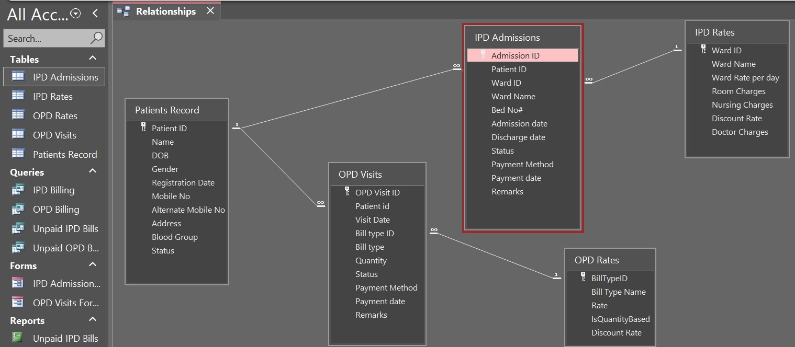

# 🏥 Hospital Records Management System
### From Spreadsheet to Relational Database — A Design & Implementation Case Study

<div align="center">


&nbsp;&nbsp;&nbsp;`——→`&nbsp;&nbsp;&nbsp;


<br>


&nbsp;&nbsp;

&nbsp;&nbsp;

&nbsp;&nbsp;


</div>

---

🔗 **Project Case Study:**  
👉 **[Explore the Detailed Migration Case Study](https://umairasad-data.github.io/spreadsheet-to-database-migration/)**

---

## Executive Summary

Migrated a hospital patient record system from a fragile Excel workbook to a normalized Microsoft Access database to resolve critical data integrity and scalability issues.

#### The Challenge
* **The Excel Experiment:** Attempted to build a unified database and data-analysis system within a single Excel workbook. 
* **Tool Limitations:** The architecture ultimately failed due to Excel's flat-data model, which lacked primary keys, referential integrity, and a clear separation between data storage and data querying.
* **Logic Breakdown:** A complex chain of five nested `XLOOKUP` formulas failed during routine inpatient/outpatient transitions, silently returning blank cells and compromising billing accuracy.

#### The Solution (Access Architecture)
* **Relational Redesign:** Engineered a robust schema featuring five normalized tables and four engine-enforced relationships.
* **Dynamic Computing:** Replaced brittle spreadsheet formula chains with live SQL queries to calculate aggregations dynamically on demand.
* **Data Security:** Deployed structured data entry forms to eliminate direct cell editing and enforce strict entity integrity.

---

## Tech Stack & Concepts

| Category | Tools / Concepts |
|---|---|
| **Database Engine** | Microsoft Access 2019+ (.accdb) |
| **Query Language** | Access SQL — `INNER JOIN`, `DateDiff`, `IIf`, `Format`, calculated fields |
| **Database Design** | Relational Database Design, Table Normalization (1NF → 3NF) |
| **Data Integrity** | Primary Keys, Foreign Keys, Referential Integrity, One-to-Many Relationships |
| **Spreadsheet (Legacy)** | Microsoft Excel — `XLOOKUP`, `IF`, `AND`, `IFERROR`, Excel Tables (Structured References) |
| **Documentation** | Custom HTML/CSS static site, Technical Writing, Data Storytelling |
| **Hosting** | GitHub Pages |

---

## Repository Contents

```
Hospital-DBMS-Design-and-Implementation/
│
├── hospital-database-successful-implementation.accdb
│   └── The working Microsoft Access database. Open in Access to inspect the
│       5-table normalized schema, 4 enforced relationships, saved queries
│       (IPD Billing, OPD Billing, Unpaid IPD Bills, Unpaid OPD Bills),
│       data-entry forms (OPD Visits Form, IPD Admissions Form), and reports.
│
├── hospital-database-unsuccessful-excel-implementation.xlsx
│   └── The original Excel workbook, preserved unmodified as a "before"
│       reference. Contains the broken XLOOKUP formula chains that motivated
│       the migration to Access.
│
├── microsoft-access-relationships.jpeg
│   └── Screenshot: The actual Access Relationships window showing all four
│       enforced one-to-many connections between the five tables.
│
└── README.md
```

---

## Database Schema

The Access database consists of five normalized tables. The relational schema and enforced relationships are shown below:
* **Zero Redundancy:** Core fields exist only in their respective logical tables (for example, `Name` is strictly stored within the `Patients Record` table).
* **On-Demand Computation:** Dynamic data—including `Age`, `No# of days`, `Total Amount`, `Discount Amount`, and `Net Amount`—is never stored directly. Instead, these values are calculated at query time from raw source data.

This architecture leverages the fundamental strength of relational databases: storing core records efficiently in linked tables while computing all aggregations and calculations dynamically on demand.

---

## Enforced Relationships

Four one-to-many relationships are enforced directly by the Access database engine:

| Parent Table | Child Table | Join Key | Cardinality |
|---|---|---|---|
| Patients Record | IPD Admissions | `Patient ID` | 1 → ∞ |
| Patients Record | OPD Visits | `Patient ID` | 1 → ∞ |
| IPD Rates | IPD Admissions | `Ward ID` | 1 → ∞ |
| OPD Rates | OPD Visits | `Bill Type ID` | 1 → ∞ |

A billing record cannot reference a patient, ward, or bill type that does not exist. This
constraint is guaranteed at the engine level and was structurally impossible to replicate
in Excel.



---

## Why Excel Was Not the Right Tool

Six specific capabilities were required that Excel cannot provide:

| # | Gap | Impact in this project |
|---|---|---|
| 1 | **No Primary Key enforcement** | Same Patient ID could be entered twice with no warning |
| 2 | **No referential integrity** | Deleting a patient record left orphan billing rows pointing to non-existent data. |
| 3 | **XLOOKUP ≠ a table relationship** | Five stacked formulas contradicted each other when a patient existed in both OPD and IPD tables |
| 4 | **No one-to-many support** | A patient with multiple visits required duplicating their personal details on every row |
| 5 | **No atomic transactions** | Allowed partial data entry (e.g., missing ward type) to silently break downstream formulas |
| 6 | **Calculated values belong in queries, not master records** | Storing `Total Amount` on the patient record failed the moment a patient had two simultaneous bills |

---

## Key Technical Outcomes

### 1. Third Normal Form (3NF) Normalization

Every repeating attribute was extracted into its own table. Patient demographic data (`Name`,
`DOB`, `Blood Group`, `Mobile No`) is stored exactly once in `Patients Record`. Ward pricing
data (`Ward Rate per day`, `Room Charges`, `Nursing Charges`, `Doctor Charges`,
`Discount Rate`) is stored exactly once in `IPD Rates`. No field in any table depends on
anything other than the primary key of that table.

### 2. Dynamic SQL Replaces Broken Formula Chains

In Excel, `Age`, `No# of days`, `Total Amount`, `Discount Amount`, and `Net Amount` were
either stored as stale calculated fields or silently returned blank for transition patients.
In Access, the `IPD Billing` query calculates all of these live, every time it runs:

```sql
SELECT
  [Patients Record].[Patient ID], [Patients Record].Name,
  [IPD Admissions].[Admission ID], [Patients Record].DOB,

  -- Age calculated from DOB at query time, never stored
  DateDiff("yyyy",[DOB],Date())
    - IIf(Format([DOB],"mmdd") > Format(Date(),"mmdd"), 1, 0) AS Age,

  [Patients Record].Gender, [Patients Record].[Mobile No],
  [IPD Admissions].[Ward ID], [IPD Admissions].[Ward Name],
  [IPD Admissions].[Bed No#],
  [IPD Admissions].[Admission date], [IPD Admissions].[Discharge date],

  -- Duration calculated from dates, never stored
  [Discharge date] - [Admission date] + 1 AS [No# of days],

  [IPD Rates].[Ward Rate per day], [IPD Rates].[Room Charges],
  [IPD Rates].[Nursing Charges], [IPD Rates].[Doctor Charges],

  -- Total Amount calculated from rates, not stored on the patient record
  ([Ward Rate per day] * [No# of days])
    + ([Room Charges] * [No# of days])
    + ([Nursing Charges] * [No# of days])
    + ([Doctor Charges] * [No# of days]) AS [Total Amount],

  [IPD Rates].[Discount Rate],
  [Total Amount] * [Discount Rate]          AS [Discount Amount],
  [Total Amount] - [Discount Amount]        AS [Net Amount],

  [IPD Admissions].Status,
  [IPD Admissions].[Payment Method],
  [IPD Admissions].[Payment date]

FROM [Patients Record]
  INNER JOIN (
    [IPD Admissions]
      INNER JOIN [IPD Rates]
        ON [IPD Admissions].[Ward ID] = [IPD Rates].[Ward ID]
  )
  ON [Patients Record].[Patient ID] = [IPD Admissions].[Patient ID];
```

Updating a ward's daily rate in `IPD Rates` automatically recalculates every patient's bill
across all queries with no manual intervention required.

### 3. The OPD-to-IPD Transition Edge Case

Two patients (P-008 and P-014) transitioned from outpatient to inpatient care. In Excel,
this required three separate formulas just to *label* the situation — a `Current Condition`
formula, a `Condition Transition` formula, and a `Current Status` formula — and even then
their billing totals returned blank because `IFERROR` suppressed the underlying conflict.

In Access, each patient simply has one row in `OPD Visits` and one row in `IPD Admissions`,
both linked via `Patient ID`. The `OPD Billing` query and the `IPD Billing` query each
retrieve their respective records independently with no conflict. No workaround formulas
are needed.

---

## Database at a Glance

| Metric | Value |
|---|---|
| Total Patients | 20 |
| OPD Visit Records | 10 |
| IPD Admission Records | 11 |
| Ward Types (with individual rate structures) | 5 (General, Semi-Private, Private, ICU, CCU) |
| Patients who transitioned OPD → IPD | 2 |
| Saved Queries | 4 (IPD Billing, OPD Billing, Unpaid IPD Bills, Unpaid OPD Bills) |
| Data Entry Forms | 2 (OPD Visits Form, IPD Admissions Form) |
| Enforced Relationships | 4 |

---

## Author

**Umair Asad**
[Umair Asad](https://github.com/umairasad-data)
